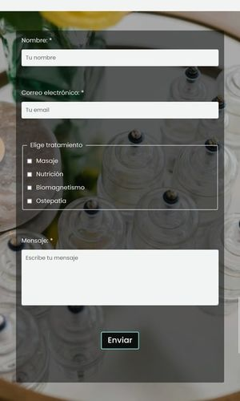
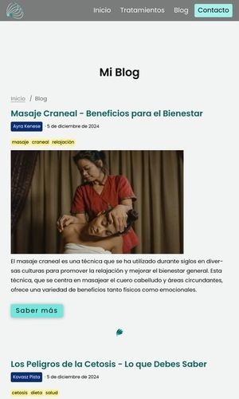

# Alire - A website project | [www.alire.me](https://www.alire.me)

## Company Description

Alire is a natural therapeutic company embracing a holistic approach, providing a variety of services including massage, osteopathy, nutrition, and biomagnetism.
This website serves as an introduction to the company's philosophy and services.

## Project Goal

The primary objective of this project was to experiment with the Astro.js framework as a component-based approach to web development.

## Technologies Used

- **Figma**: Creating design and logos. [Link to Figma design](https://www.figma.com/proto/Ye1NIbMhdbf1XPc3QSTGgw/ALIRE?node-id=276-3033&t=9T0ZsaBmUtFDVFD5-1)
- **SCSS**: Styling with modular and advanced CSS features
- **Astro.js**: Framework for building the site with components

### Hosting

- **Hostinger**: The project is hosted on Hostinger.
  Since Astro doesn't offer a deployment guide specifically for Hostinger, setting up the site required some unexpected experimentation.

## Libraries Used

- **Accessible Astro s omponents**: Utilized for building accessible and reusable UI components [Link](https://github.com/markteekman/accessible-astro-components)
- **Slugify by sindresorhus**: Included to handle string conversion for URLs and identifiers [Link](https://github.com/sindresorhus/slugify)

## Challenges Faced

1. **First Time Using a Framework**

   - This project marked my first experience with a framework, moving from traditional static development to component-based architecture with Astro.js.

2. **Advanced Git Practices**

   - Explored branching and rebasing techniques.
   - Worked extensively with git logs, including `reflog` for troubleshooting.
   - Gained experience with merging versus rebasing workflows.
   - Practiced resetting files and resolving merge conflicts.
   - The focus was on experimentation with Git workflows rather than achieving perfection.

3. **Working with Markdown Files**

   - Gained familiarity with basic Markdown syntax for formatting content, such as headings, lists, links, and images.
   - Explored the use of frontmatter to include metadata like titles, descriptions, and configuration options at the beginning of Markdown files.
   - Learned how Markdown integrates with Astro to define page-level properties and improve project organization.
   - Encountered challenges in formatting complex elements like nested lists and code blocks, but developed a clearer understanding through practice and reference to documentation.

4. **Hostinger and Astro Compatibility**

   - Hostinger and Astro do not seamlessly integrate. The deployment required custom configurations.

     - Creating [Publish.yml](/.github/workflows/publish.yml) for the build process
     - Using the YAML file to generate the `dist` folder on the build branch
     - Hostinger automatically detects the `dist` folder for deployment using its CI/CD pipeline.

## Planned Improvements

- Adding a "Back to Top" link for better navigation.
- Implementing a "Skip to Main Content" feature to enhance accessibility.
- Integrating light and dark mode for a customizable user experience.
- Adding animations.
- Improve age accessability.

## Known Bugs

1. **Modal Focus Issue**:
   - After closing any of the four modals, the focus returns to the third button instead of the button that opened the modal. This needs to be fixed to ensure proper focus management and accessibility.

## What I would do different next time

- Create and follow a more robust styling strategy.
- Use pre-made componenents and learn from them.

## Happy with

- The overall look of the website.
- [PageSpeed Scores](https://pagespeed.web.dev/analysis/https-www-alire-me/qicj9x98xk?form_factor=mobile)

## Image attributions:

hero-image.jpg : [Photo by Kaboompics.com](https://www.pexels.com/photo/composition-of-cosmetic-bottle-with-pink-rose-petals-and-wooden-plate-4041392/)
form-background.jpg : [Photo by RDNE Stock Project](https://www.pexels.com/photo/clear-glass-cups-on-glass-table-8312798/)
cta-image-01.jpg : [Photo by Monika Grabowska](https://unsplash.com/photos/purple-and-green-vegetable-in-black-bowl-M1y4TFQ9zVk?utm_content=creditCopyText&utm_medium=referral&utm_source=unsplash)
cta-image-02.jpg : [Photo by Sean Stratton](https://unsplash.com/photos/black-stacking-stones-on-gray-surface-ObpCE_X3j6U?utm_content=creditCopyText&utm_medium=referral&utm_source=unsplash)
cta-image-03.jpg : [Photo by Miklas Ohlrogge](https://unsplash.com/photos/woman-walking-on-train-railway-Mof1w0Jn3HA?utm_content=creditCopyText&utm_medium=referral&utm_source=unsplash)
cta-image-02.jpg : [Photo by Caju Gomes](https://unsplash.com/photos/woman-holding-sliced-watermelon-QDq3YliZg48?utm_content=creditCopyText&utm_medium=referral&utm_source=unsplash)
nutrition-overlay.jpg: [Photo by Adonyi Gábor](https://www.pexels.com/photo/assorted-vegetables-on-brown-wooden-table-1414651/)
massage-overlay.jpg: [Photo by Anna Tarazevich](https://www.pexels.com/photo/a-person-massaging-a-client-s-bare-back-6560289/)
osteopathy-overlay.jpg: [Photo by Yan Krukau](https://www.pexels.com/photo/woman-in-white-long-sleeve-shirt-stretching-woman-s-arm-5793700/)
biomagnet-overlay.jpg: [Photo by David Bartus](https://www.pexels.com/photo/levitating-metal-discs-7440924/)
post-1.jpg: [Photo by Tima Miroshnichenko](https://www.pexels.com/photo/a-masseuse-massaging-a-woman-6186765/)
post-2.jpg: [Photo by Serhii Kalyn](https://unsplash.com/photos/two-pieces-of-raw-meat-sit-on-a-cutting-board-XELZYG_aXkU?utm_content=creditCopyText&utm_medium=referral&utm_source=unsplash)
post-3.jpg: [Photo by Thought Catalog](https://unsplash.com/photos/silver-fork-and-knife-on-plate-fnztlIb52gU?utm_content=creditCopyText&utm_medium=referral&utm_source=unsplash)
post-4.jpg: [Photo by Nikko Macaspac](https://unsplash.com/photos/photo-of-person-reach-out-above-the-water-6SNbWyFwuhk?utm_content=creditCopyText&utm_medium=referral&utm_source=unsplash)
post-5.jpg: [Photo by Lukas](https://www.pexels.com/photo/children-s-team-building-on-green-grassland-296301/)

